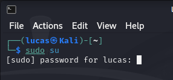
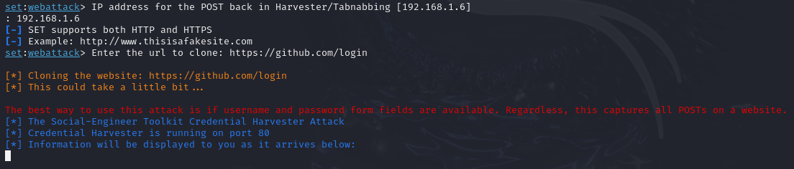
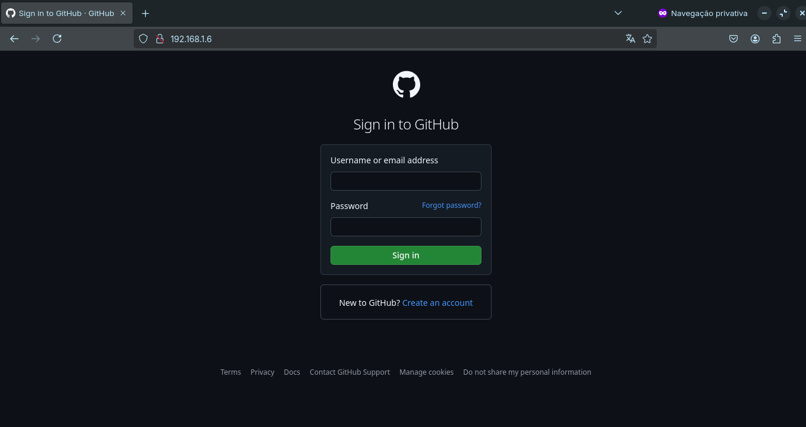
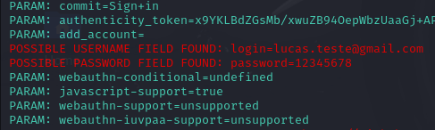

# Phishing para captura de senhas

Desafio de Projeto do [Santander Bootcamp Cibersegurança #2](https://www.dio.me/bootcamp/santander-ciberseguranca-2024)

Objetivo: Criar um Phishing que simule a pagina de login do Facebook com o objetivo de capturar login e senha.

### Ferramentas Utilizadas

- Kali Linux
- setoolkit

### Configurando o Phishing no Kali Linux

- Abrir o Terminal do Kali Linux;
- Acessar como root:
  - Acesso root: ``` sudo su ``` (Sera solicitado a senha; A senha não fica visivel no terminal, digite normalmente e aperte enter   para confirmar)


- Iniciando o setoolkit: ``` setoolkit ```
- Selecione o tipo de ataque: ``` 1) Social-Engineering Attacks ```
- Selecione o vetor de ataque: ``` 2) Web Site Attack Vectors ```
- Selecione o método de ataque: ``` 3) Credential Harvester Attack Method ```
- Selecione o método de ataque: ``` 2) Site Clone ```

Em seguida sera solicitado um endereço de IP que sera o servidor onde irar executar o phishing, o sistema ja recomenda o IP do computador, aperte enter para continuar.


- Enter the url to clone: (Exemplo: ```https://github.com/login```)

Neste momento o phishing ja esta em funcionamento.


Para Testar basta copiar o IP do seu computador e colar no navegador, Neste momento no terminal do Kali Linux o sistema ja ira reconhecer o acesso.


No navegador basta logar normalmente, e a ferramenta ira fazer a captura do login e senha.


### Resutados


## Autor

- [Lucas Roberto](https://github.com/LucasR022)
